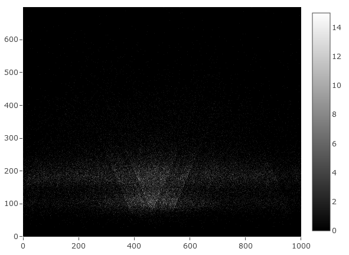

# A commandline tool for making V-plot matrices from genomics data

`vplot` is a small Rust tool for generating V-plot matrices. By default it makes
matrices using the original style of fragment midpoints developed in [Henikoff,
et. al. 2011](https://www.pnas.org/content/108/45/18318), but it also supports
making plots from fragment ends, or mapping the whole fragment instead. These
features make `vplot` a versatile tool for visualizing MNase-seq, ATAC-seq, or
CUT&RUN data.

## Install

### Prebuilt binary

Download a compatible binary for your operating system from the [Releases
Page](https://github.com/snystrom/vplot/releases). Can't find one that works?
File an [issue](https://github.com/snystrom/vplot/issues), or compile from
source (instructions below).

Place binary in convenient location (ie ~/bin), add that location to your PATH
if it isn't already.

``` sh
# Adds ~/bin to PATH
echo "export PATH=\$PATH:~/bin" >> ~/.bashrc
```

Test install:

``` sh
vplot --version
```

### Compile from source

[Install Rust](https://www.rust-lang.org/tools/install). It's super easy!

Install the binary
``` sh
cargo install --git https://github.com/snystrom/vplot
```

Test install
``` sh
vplot --version
```

## Usage

`vplot` takes aligned reads as an indexed bam file and a bed file of genomic
coordinates as input to return a CSV-format matrix of fragment size plotted
against genomic coordinates. `vplot` can create aggregate plots of multiple
regions by providing multiline entries in the regions bed file, or can create
matrices for each region separately by setting the `--multi` flag, in which case
a separate matrix per region will be written.

In the returned matrix, the columns are genomic coordinate (leftmost
column is 5' end), and rows are fragment size (top row is *largest* fragment size).
In keeping with the original spirit of the original Henikoff V-plot, larger fragments are
returned at the top of the matrix, while small fragments are plotted along the
bottom. This can be a little annoying for indexing later, though, because row 1
corresponds to the max fragment size. To make rowwise positional indexing
easier, set `--invert` to return smaller fragments at the top of the matrix
(i.e. row 1 = 1bp fragment size).

Finally, by setting `--fragment-type` (`-f`) you can control how reads are
summarized in the matrix. Setting `-f midpoint` (default) only adds signal at
the midpoint of a fragment. Setting `-f ends` adds signal at the start and end
positions of each read. Setting `-f fragment` adds signal along the full length
of the read fragment. Typically, `midpoint` is what you want, but plotting whole
fragments or fragment ends could be useful for different assays & data visualization.

Like examples? Here you go:

``` sh

# regions must be equal width
$ cat regions.bed
chr2L   100 200 .
chr3R   5000 5100 .

# remember to index your bam file
$ samtools index reads.bam

# default behavior aggregates reads & prints to stdout
$ vplot reads.bam regions.bed > vplot_matrix.csv

# make vplots for each region separately instead with --multi
# this writes a file per region
$ vplot --multi reads.bam regions.bed 
    # returns:
    chr2L-100-200.vmatrix.csv
    chr3R-5000-5100.vmatrix.csv

# set a custom file prefix for multi-output files:
$ vplot --multi -o myPrefix_ reads.bam regions.bed 
    # returns:
    myPrefix_chr2L-100-200.vmatrix.csv
    myPrefix_chr3R-5000-5100.vmatrix.csv
    
$ vplot --html -o ./ reads.bam regions.bed 
   # returns:
   reads.bam.vmatrix.csv
   reads.bam.vplot.html
```


## Heatmap Visualizations

`vplot` can also be used to generate vplot heatmaps. By setting `--html`,
`vplot` will export an interactive vplot heatmap in html format that can be
viewed in a web browser.

View an [interactive example](https://snystrom.github.io/vplot-heatmap-example.html).




## Full Help Text

``` sh
vplot 0.3.41

USAGE:
    vplot [FLAGS] [OPTIONS] <bam> <regions>

FLAGS:
    -h, --help       
            Prints help information

    -i, --invert     
            Invert the matrix so that the smallest fragments appear at the top

    -m, --multi      
            Instead of aggregating reads into 1 matrix, write 1 matrix for each region. Matrices are written as 1 csv
            per region named: `chr-start-end.vmatrix.csv`
    -V, --version    
            Prints version information

        --html       
            Write an interactive vplot heatmap in HTML format. Files are suffixed with `.vplot.html` following the rules
            outlined in the `--multi` helptext.
            
            If --html is set but -o is unset, heatmap will be written to "{bamfile}.vplot.html".

OPTIONS:
    -f, --fragment-type <fragment-type>    
            How reads are counted in the matrix. Using either the midpoint of the fragment, fragment ends, or the whole
            fragment [default: midpoint]  [possible values: midpoint, ends, fragment]
    -x, --max-size <max-fragment-size>     
            Maximum fragment size to include in the V-plot matrix [default: 700]

    -o, --output <output>                  
            Set output file name or output directory. This option behaves differently depending on which input flags are
            set. See --help for details.
            
            If --multi is unset and -o is set to a directory, the output file will be written to:
            outdir/<bamfile>.vmatrix.csv. if --multi is unset and -o is a file path, output file will be written to this
            file name. if --multi is set and -o is a directory, files will be written to outdir as: outdir/chr-start-
            end.vmatrix.csv. if --multi is set and -o is a string, the string will be used as a prefix,
            and files will be written as: <prefix>chr-start-end.vmatrix.csv.
            
            Examples:
            
            vplot reads.bam regions.bed > output.vmatrix.csv
            
            vplot -o outdir/ reads.bam regions.bed
            
            returns: outdir/reads.bam.vmatrix.csv
            
            vplot -o matrix.csv reads.bam regions.bed
            
            returns: matrix.csv
            
            vplot -m -o outdir/ reads.bam regions.bed
            
            returns: - outdir/chr1-1000-2000.vmatrix.csv
            
            - outdir/chr2-1000-2000.vmatrix.csv
            
            vplot -m -o myPrefix_ reads.bam regions.bed
            
            returns:
            
            - myPrefix_chr1-1000-2000.vmatrix.csv
            
            - myPrefix_chr2-1000-2000.vmatrix.csv
            
            vplot -m -o outdir/myPrefix_ reads.bam regions.bed
            
            returns:
            
            - outdir/myPrefix_chr1-1000-2000.vmatrix.csv
            
            - outdir/myPrefix_chr2-1000-2000.vmatrix.csv [default: -]

ARGS:
    <bam>        
            Path to an indexed bam file

    <regions>    
            Path to a bed file (must be in bed4 format: chr, start, end, strand) Of a region (or regions) in which to
            generate the vplot. If using multiple regions, all entries must be the same width. If setting multiple
            regions, reads will be aggregated into a single matrix unless `--multi` is set
```
